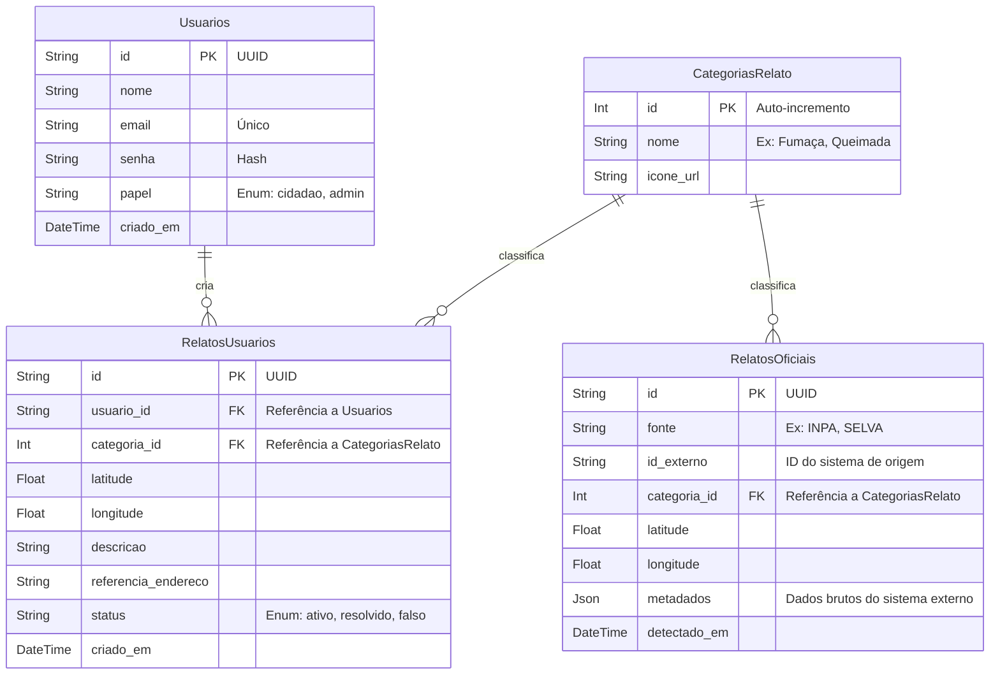

# Modelagem de Banco de Dados: Curupira System

Este documento descreve as tabelas, campos e relacionamentos propostos para o banco de dados do sistema Curupira, utilizando o PostgreSQL. A modelagem tem como foco inicial permitir que cidadãos criem relatos de problemas ambientais (queimadas, fumaça, etc) e cruzar essas informações com dados de fontes oficiais (INPA/SELVA).

## Diagrama Entidade-Relacionamento

## Dicionário de Dados

### Tabela `Usuarios`
Gerencia o acesso ao sistema Curupira.
- `id`: Identificador único universal (UUID).
- `nome`: Nome completo do usuário.
- `email`: Endereço de e-mail (usado para login, deve ser único).
- `senha`: Senha criptografada do usuário.
- `papel`: Define as permissões (`cidadao` comum ou `admin` que gerencia o sistema).
- `criado_em`: Data e hora em que a conta foi criada.

### Tabela `CategoriasRelato`
Tipos padronizados de problemas que podem ser relatados.
- `id`: Identificador sequencial.
- `nome`: O nome da categoria (ex: "Fumaça", "Queimada", "Cheiro Forte Químico").
- `icone_url`: URL ou caminho para a imagem do pino que será usado no mapa.

### Tabela `RelatosUsuarios`
Dados reportados diretamente pelos usuários (cidadãos) na plataforma.
- `id`: Identificador único (UUID).
- `usuario_id`: ID do usuário que fez o relato.
- `categoria_id`: O tipo de problema.
- `latitude` / `longitude`: Coordenadas geográficas exatas do foco.
- `descricao`: Opcional, texto fornecido pelo usuário com mais detalhes.
- `referencia_endereco`: Texto que ajuda a localizar (ex: "Bairro Compensa, próximo a ponte").
- `status`: Estado atual do relato (ex: `ativo` quando criado, `falso` se reportado por moderação, `resolvido` quando finalizado).
- `criado_em`: Momento em que o relato foi registrado.

### Tabela `RelatosOficiais`
Dados ingeridos a partir de integrações ou satélites de sistemas parceiros (INPA / app SELVA).
- `id`: Identificador único (UUID) interno no Curupira.
- `fonte`: Quem originou a informação (`INPA`, `SELVA`, etc.).
- `id_externo`: Opcional, caso a fonte já envie um ID próprio que precisemos rastrear.
- `categoria_id`: O tipo de problema mapeado para nosso padrão.
- `latitude` / `longitude`: Coordenadas do foco detectado.
- `metadados`: Campo livre (JSON) para guardar todo e qualquer dado extra que a fonte enviar (temperatura, níveis de monóxido de carbono, etc) sem necessidade de alterar o esquema do banco.
- `detectado_em`: O momento exato que o sensor detectou o problema (frequentemente diferente de quando o dado entrou no nosso sistema).
